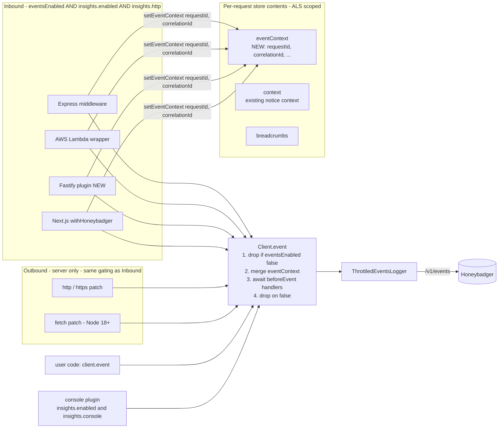
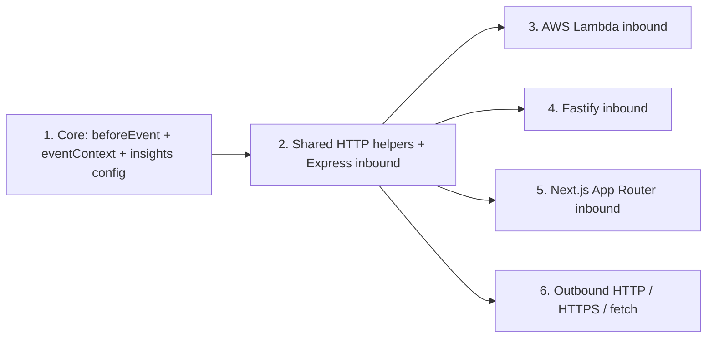

# Automatic HTTP instrumentation for Honeybadger JS

## Context

`Client.event()` (`packages/core/src/client.ts:314`) is wired to `ThrottledEventsLogger` (`packages/core/src/throttled_events_logger.ts`) which batches events to `/v1/events`. Today the only auto-emitter is the console plugin (`packages/core/src/plugins/events.ts`); HTTP request instrumentation is entirely manual.

The Honeybadger client spec requires framework integrations to emit per-request events with durations, attach a stable correlation id to every event in a request, and allow users to filter or augment events via a `beforeEvent` hook.

This plan adds:

1. A `beforeEvent` hook on `Client` (async by default — handler may return `Promise<boolean | void>`).
2. A new `eventContext` slot on the request store. Every `client.event()` call merges `eventContext` into the outgoing payload, and integrations seed it with two distinct fields:
   - `requestId` — unique per request. Read from `x-request-id` / `request-id` headers, or generated when absent.
   - `correlationId` — may span multiple requests in a logical trace. Read from `x-correlation-id` / `x-amzn-trace-id` headers, falling back to the request's `requestId` when absent (so events always carry both fields, and a single-request flow naturally has `requestId === correlationId`).
3. A two-tier configuration model for Insights events. **All flags default to `false`.** This is a **breaking change** for existing `eventsEnabled: true` users (who today get console events automatically) and will ship behind a **major version bump**. No compatibility shim is planned; the changelog and upgrade guide call out the new explicit opt-in.
   - `eventsEnabled` (existing, default `false`) — **global kill switch** for everything that ships to `/v1/events`: programmatic `client.event()`, the console plugin, and HTTP auto-events. When `false`, nothing fires (semantic change for programmatic `event()`, which previously bypassed all gates).
   - `insights.enabled` (new, default `false`) — master gate for **automatic instrumentation only**. When `false`, the per-source flags don't matter; when `true`, the per-source flags decide which sources fire.
   - `insights.console` (new, default `false`) — gates the console-instrumentation plugin. Only effective when `insights.enabled` is true.
   - `insights.http` (new, default `false`) — gates HTTP auto-events (inbound + outbound).
   `insights` must be an object. Boolean shorthands are intentionally **not** accepted; users opt in by setting `insights.enabled: true` together with the per-source flags they want.
4. **Inbound** automatic request events for **Express**, **AWS Lambda** (HTTP-shaped invocations), **Fastify**, and **Next.js App Router**.
5. **Outbound** automatic request events for Node `http` / `https` / `fetch` (server-side only — browser deferred).

Configuration recipes:

| Goal | Settings |
|---|---|
| Everything off (default) | `eventsEnabled: false` |
| Programmatic `event()` only, no auto-instrumentation | `eventsEnabled: true, insights: { enabled: false }` |
| Console events only | `eventsEnabled: true, insights: { enabled: true, console: true }` |
| HTTP auto-events only | `eventsEnabled: true, insights: { enabled: true, http: true }` |
| Console + HTTP auto-events | `eventsEnabled: true, insights: { enabled: true, console: true, http: true }` |
| Master kill switch (programmatic + auto) | `eventsEnabled: false` |



---

## 1. Core: `beforeEvent`, `eventContext`, `insights` config

### 1a. Types — `packages/core/src/types.ts`

```ts
export interface BeforeEventHandler {
  (event: EventPayload): boolean | void | Promise<boolean | void>
}

export type StoreContents = {
  context: Record<string, unknown>,
  eventContext: Record<string, unknown>,   // NEW
  breadcrumbs: BreadcrumbRecord[]
}

export interface HoneybadgerStore {
  // ...existing...
  setEventContext(ctx: Record<string, unknown>): void   // NEW
  clearEventContext(): void                              // NEW
}

export interface InsightsConfig {
  enabled?: boolean         // master gate for AUTOMATIC instrumentation (default false)
  console?: boolean         // console-instrumentation plugin (default false; only effective when enabled is true)
  http?: boolean            // HTTP auto-events, inbound + outbound (default false)
}

// Config (existing fields retained):
//   eventsEnabled?: boolean   // global kill switch for /v1/events
//   insights?: InsightsConfig
```

`eventsEnabled` is the existing top-level field; it stays.

### 1b. Defaults — `packages/core/src/defaults.ts`

Keep `eventsEnabled: false`. Add:

```ts
insights: { enabled: false, console: false, http: false }
```

Everything is off by default. To get any auto-instrumentation, the user must set both `eventsEnabled: true` AND `insights.enabled: true` AND the per-source flag they want.

> **Breaking change:** existing users on `eventsEnabled: true` (today's default opt-in for console events) will lose console events when this ships. Shipped behind a major version bump; no compat shim.

### 1c. Stores

Each store implementation must (a) initialize `eventContext: {}` alongside `context`, (b) implement `setEventContext` (merge) and `clearEventContext` (reset to `{}`), and (c) extend `clear()` to also reset `eventContext` so existing `client.clear()` matches today's "clears error context" behavior, now also clearing event context.

- `packages/core/src/store.ts` (`GlobalStore`) — mirror `setContext`/`clear` patterns at lines 26 and 37.
- `packages/js/src/server/async_store.ts` — mirror lines 51 and 62.
- `packages/js/src/server/stacked_store.ts` — proxy to `__activeStore()`.
- Initial `StoreContents` construction sites: `packages/core/src/client.ts:120` and `packages/js/src/server.ts:97` (StackedStore constructs its own at line 17). Add `eventContext: {}` everywhere a `StoreContents` is created.

### 1d. `runBeforeEventHandlers` — `packages/core/src/util.ts`

Async-capable, modeled on `runBeforeNotifyHandlers` at line 162 (which already collects sync + async results and is consumed via `Promise.allSettled` in `__runPreconditions` at line 426).

```ts
export async function runBeforeEventHandlers(
  payload: EventPayload,
  handlers: BeforeEventHandler[]
): Promise<boolean> {
  for (const handler of handlers) {
    const result = await handler(payload)   // mutates payload in place
    if (result === false) return false
  }
  return true
}
```

Handlers run sequentially (matches `beforeNotify` semantics — earlier handlers can decide whether later ones run, and mutations are observed in order).

### 1e. `Client` — `packages/core/src/client.ts`

- Add `protected __beforeEventHandlers: BeforeEventHandler[] = []`.
- Add public `beforeEvent(handler: BeforeEventHandler): this` mirroring `beforeNotify` at line 123.
- Add public `setEventContext(ctx): this` and `clearEventContext(): this` that delegate to `__store`. Mirror the `setContext` pattern at line 133 (no-op when `ctx` is not an object).
- Modify `event()` (line 314):
  ```ts
  event(type, data?) {
    if (typeof type === 'object') { data = type; type = type['event_type'] as string ?? undefined }

    // Global kill switch: eventsEnabled === false drops everything,
    // including programmatic events. (Semantic change from today.)
    if (!this.config.eventsEnabled) {
      this.logger.debug('skipping event: eventsEnabled is false')
      return
    }

    const eventContext = this.__store.getContents('eventContext')
    const payload: EventPayload = {
      event_type: type,
      ts: new Date().toISOString(),
      ...eventContext,    // merged first so explicit data wins
      ...data,
    }
    runBeforeEventHandlers(payload, this.__beforeEventHandlers).then((shouldSend) => {
      if (!shouldSend) {
        this.logger.debug('skipping event: beforeEvent handler returned false')
        return
      }
      this.__eventsLogger.log(payload)
    }).catch((err) => {
      this.logger.error('beforeEvent handler threw; dropping event', err)
    })
  }
  ```
  `event()` keeps its `void` return — async handlers run via fire-and-forget, but the queue push waits on them. `flushAsync()` already exists for callers (e.g. Lambda wrapper) that need to wait for the queue to drain; the new `beforeEvent` chain resolves before the payload enters the queue, so any await of `flushAsync()` will include events with completed handlers as long as `event()` was called before `flushAsync()`.

### 1f. Shutdown plugin — `packages/js/src/server/integrations/shutdown_plugin.ts`

Currently gated only on `eventsEnabled` (line 13). Keep gating on `eventsEnabled` — that's the global kill switch and it correctly suppresses the flush listener when no events can ever be queued.

### 1g. Config resolver — `packages/core/src/util.ts`

Add a single normaliser used everywhere automatic-instrumentation flags are read. It applies the **two-tier** rule: `eventsEnabled` AND `insights.enabled` AND the per-source flag must all be on.

```ts
export interface ResolvedInsights {
  console: boolean
  http: boolean
}

export function resolveInsights(config: Config): ResolvedInsights {
  // Tier 1: global kill switch.
  if (!config.eventsEnabled) return { console: false, http: false }

  // Tier 2: automatic-instrumentation master.
  if (!config.insights.enabled) return { console: false, http: false }

  // Tier 3: per-source. Both default false; users opt in explicitly.
  return {
    console: config.insights.console ?? false,
    http:    config.insights.http    ?? false,
  }
}
```

Programmatic `client.event()` does **not** go through `resolveInsights` — it gates only on `config.eventsEnabled` (see §1e). `resolveInsights` is for automatic instrumentation only.

**Footgun watch:** writing `insights: { http: true }` alone is **not enough** — `enabled` defaults to `false`, which short-circuits everything. Users must write `insights: { enabled: true, http: true }`. The recipes table in the intro documents this. We deliberately don't auto-promote sub-flags into `enabled: true`; explicit is clearer than implicit, and the resolver stays trivially predictable.

**Breaking change:** existing users with `eventsEnabled: true` will lose console events when they upgrade. This ships as a **major version bump**; no compatibility shim is planned. The changelog and upgrade guide spell out the new explicit opt-in (`insights: { enabled: true, console: true }`) so users can restore prior behavior in one line.

---

## 2. Shared HTTP-event helper

**New file:** `packages/js/src/server/instrumentation/http_event.ts`

```ts
export function getOrCreateRequestId(headers): string
// Unique per request.
// Reads x-request-id, then request-id headers.
// Falls back to crypto.randomUUID() if available, else a Math.random-based id.

export function getOrCreateCorrelationId(headers, requestId: string): string
// May span multiple requests in a trace.
// Reads x-correlation-id, then x-amzn-trace-id headers.
// Falls back to the supplied requestId so callers always have both fields populated.

// Convenience helper used by every framework integration:
export function seedRequestEventContext(headers): { requestId: string; correlationId: string } {
  const requestId = getOrCreateRequestId(headers)
  const correlationId = getOrCreateCorrelationId(headers, requestId)
  return { requestId, correlationId }
}

export function startTimer(): bigint  // process.hrtime.bigint()
export function durationMs(start: bigint): number  // integer ms

export function buildRequestEventPayload(input: {
  framework: 'express' | 'fastify' | 'nextjs' | 'lambda'
  method?: string
  path?: string
  route?: string
  status?: number
  duration?: number
  extra?: Record<string, unknown>
}): Record<string, unknown>

// --- outbound additions, see section 7 ---
export function buildOutboundPayload(input: {
  client: 'http' | 'https' | 'fetch'
  method?: string
  url?: string
  host?: string
  path?: string
  status?: number
  duration?: number
  error_class?: string
  error_message?: string
}): Record<string, unknown>

export function isHoneybadgerEndpoint(
  url: string,
  configEndpoint: string,
  appEndpoint: string
): boolean

export function extractFetchUrl(input: unknown): string
```

`event_type` is set per-framework at the call site (`request.express`, `request.fastify`, `request.nextjs`, `request.lambda`). The `framework` field is duplicated as a sibling so cross-framework querying works. Outbound emissions use `request.outbound` (see section 7). **No `request_id`/`correlation_id` field is hard-coded on the payload builder** — both `requestId` and `correlationId` are placed on `eventContext` by the framework integration and automatically merged onto every event in the request.

**Path strategy:** prefer route pattern, fall back to actual path.
- Express: `req.route?.path ?? req.path`
- Fastify: `req.routeOptions?.url ?? req.routerPath ?? req.url` (covers v4+ and v3)
- Next.js: route pattern unavailable; use `new URL(req.url).pathname`
- Lambda: `event.requestContext?.http?.path ?? event.path`

---

## 3. Express — `packages/js/src/server/middleware.ts`

```ts
export function requestHandler(req, res, next) {
  this.withRequest(req, () => {
    this.setEventContext(seedRequestEventContext(req.headers))
    if (!resolveInsights(this.config).http) return next()

    const start = startTimer()
    let emitted = false
    const emit = () => {
      if (emitted) return
      emitted = true
      this.event('request.express', buildRequestEventPayload({
        framework: 'express',
        method: req.method,
        path: req.path,
        route: req.route?.path,
        status: res.statusCode,
        duration: durationMs(start),
      }))
    }
    res.once('finish', emit)
    res.once('close', emit)
    next()
  }, next)
}
```

`setEventContext` runs even when `insights.http` is off — so user `client.event(...)` calls in the request still get `requestId` and `correlationId` (subject to `eventsEnabled`). Listeners are registered **inside** the `withRequest` callback so the ALS context is captured at registration. `errorHandler` is unchanged: Express's default error handler writes the 500, then `finish`/`close` fires.

---

## 4. AWS Lambda — `packages/js/src/server/aws_lambda.ts`

In both `asyncHandler` (line 30) and `syncHandler` (line 57), inside the `hb.run(() => { ... })` block:

- Always seed event context (HTTP or not):
  ```ts
  if (isApiGatewayEvent(event)) {
    hb.setEventContext(seedRequestEventContext(event.headers || {}))
  } else {
    // Non-HTTP triggers don't have correlation/request headers — use awsRequestId
    // as the requestId, and treat the X-Ray trace id (if present in env) as the
    // correlationId, otherwise mirror requestId.
    const requestId = context.awsRequestId
    const correlationId = process.env._X_AMZN_TRACE_ID || requestId
    hb.setEventContext({ requestId, correlationId })
  }
  ```
- If `resolveInsights(hb.config).http` and `isApiGatewayEvent(event)`:
  - capture `start = startTimer()`
  - on resolve: emit `request.lambda` with `status = result?.statusCode ?? 200`
  - on reject/throw: emit `request.lambda` with `status = 500` **before** calling `reportToHoneybadger`
- For non-HTTP triggers (SQS, S3, EventBridge, scheduled), do **not** emit a request event, but `requestId` and `correlationId` are still on event context.

Add file-local helpers `isApiGatewayEvent(event)` and `lambdaStatus(result)`.

---

## 5. Fastify — NEW

**New file:** `packages/js/src/server/fastify.ts`

The plugin is exposed as a **factory** that takes the Honeybadger client as an argument and returns a Fastify-compatible plugin function. This avoids polluting the singleton with framework-specific methods (no `Honeybadger.fastifyPlugin` binding) and mirrors the convention used by other Fastify plugins (`fastify.register(somePlugin(opts))`).

Both hooks run inside `client.withRequest(req, ...)`. Because `withRequest` keys its store contents off `req[kHoneybadgerStore]` (`packages/js/src/server/async_store.ts:77-82`), the second `withRequest` call in `onResponse` reuses the same store contents object that was populated in `onRequest`, so `eventContext` (and any context the user added via `client.setContext(...)` during the route handler) is visible at emit time.

```ts
const kHbStart = Symbol('honeybadger.start')

export function fastifyPlugin(client) {
  return function plugin(fastify, _opts, done) {
    fastify.addHook('onRequest', (req, _reply, hookDone) => {
      client.withRequest(req, () => {
        client.setEventContext(seedRequestEventContext(req.headers))
        if (resolveInsights(client.config).http) req[kHbStart] = startTimer()
        hookDone()
      })
    })

    fastify.addHook('onResponse', (req, reply, hookDone) => {
      client.withRequest(req, () => {
        if (resolveInsights(client.config).http && req[kHbStart] != null) {
          client.event('request.fastify', buildRequestEventPayload({
            framework: 'fastify',
            method: req.method,
            path: req.url,
            route: req.routeOptions?.url ?? req.routerPath,
            status: reply.statusCode,
            duration: durationMs(req[kHbStart]),
          }))
        }
        hookDone()
      })
    })

    done()
  }
}
```

Duck-typed against fastify (no type import) so we don't add `fastify` as a dependency. Supports Fastify 3+ (existing example uses 3.29.4).

**Usage:**
```ts
import Honeybadger from '@honeybadger-io/js'
import { fastifyPlugin } from '@honeybadger-io/js/server/fastify'

fastify.register(fastifyPlugin(Honeybadger))
```

Re-export from the `server` entry of `@honeybadger-io/js` so users can also import it as `import { fastifyPlugin } from '@honeybadger-io/js'` — but **do not** attach it to the singleton instance.

---

## 6. Next.js App Router — `packages/nextjs/src/with-honeybadger.ts`

The wrapper currently lacks per-request context isolation. Wrap the body in `Honeybadger.run(...)` so each request gets its own ALS contents (and hence its own `eventContext`).

```ts
return new Proxy(handler, {
  apply: async (target, thisArg, args) => {
    return Honeybadger.run(async () => {
      const reqArg = args[0] instanceof Request ? args[0] : null
      if (reqArg) {
        Honeybadger.setEventContext(seedRequestEventContext(headersToObject(reqArg.headers)))
      }
      const start = (resolveInsights(Honeybadger.config).http && reqArg) ? startTimer() : null
      try {
        const response = await Reflect.apply(target, thisArg, args)
        if (start) emitNextEvent(reqArg, response, start)
        return response
      } catch (error) {
        if (start) emitNextEvent(reqArg, { status: 500 }, start)
        await Honeybadger.notifyAsync(error as Error)
        throw error
      }
    })
  },
})
```

`emitNextEvent` reads method, `new URL(req.url).pathname`, status from `response.status`, calls `Honeybadger.event('request.nextjs', buildRequestEventPayload({...}))`. `headersToObject` flattens `Headers` to a `Record<string, string>` for the helper. Pages Router and route-pattern detection are deferred.

The shared helper lives in `@honeybadger-io/js` and is imported via the existing public package entry.

---

## 7. Outbound HTTP and `fetch` instrumentation (server only)

Patches outbound HTTP clients so any call from a **server runtime** emits a `request.outbound` event when `resolveInsights(client.config).http` is true (i.e. `eventsEnabled && insights.enabled !== false && insights.http === true`). Browser-side outbound is deferred (see "Out of scope").

Together these cover the vast majority of Node HTTP traffic: `http.request` is the substrate for axios, got, node-fetch, superagent, request, and direct `http`/`https` callers. Node 18+ `fetch` is implemented on undici and bypasses `http.request`, so it must be patched separately.

All emissions share `event_type: 'request.outbound'` so users filter with a single key in Insights. The emitting transport is identified by a `client` field: `'http'` | `'https'` | `'fetch'`.

### 7a. Server plugin — NEW `packages/js/src/server/integrations/outbound_http_plugin.ts`

Loaded by default via `DEFAULT_PLUGINS` in `packages/js/src/server.ts:16`. Returns a `Plugin` whose `load(client)` performs one-shot patches; emission is gated at call time on `resolveInsights(client.config).http` so `configure()` toggles take effect without `shouldReloadOnConfigure`.

The plugin body is intentionally **just composition** — every meaningful behaviour lives in a small named function so each piece is testable and the plugin reads top-down. Helpers go into a sibling file `packages/js/src/server/instrumentation/outbound_http.ts` (kept distinct from `http_event.ts`, which is shared between inbound and outbound).

**Plugin entry point:**
```ts
import * as http from 'http'
import * as https from 'https'
import { patchHttpModule, patchGlobalFetch } from '../instrumentation/outbound_http'

export default function outboundHttpPlugin(): Plugin {
  return {
    shouldReloadOnConfigure: false,
    load: (client) => {
      patchHttpModule(client, http, 'http')
      patchHttpModule(client, https, 'https')
      patchGlobalFetch(client)
    }
  }
}
```

**`outbound_http.ts` — small focused helpers:**

```ts
// Single emission point — every transport funnels through here.
function emitOutbound(client, params: OutboundParams): void {
  client.event('request.outbound', buildOutboundPayload({
    ...params,
    url: filterUrl(params.url, client.config.filters),
    duration: durationMs(params.start),
  }))
}

// Returns true if the URL targets Honeybadger's own API/app endpoints — caller
// must short-circuit before emitting to avoid recursive self-traffic.
function isSelfTraffic(client, url: string): boolean {
  return isHoneybadgerEndpoint(url, client.config.endpoint, client.config.appEndpoint)
}

// Wraps the response/error listeners on a ClientRequest so the event fires
// exactly once regardless of which terminal event arrives first.
function wireClientRequestEmit(client, req, base: OutboundBase): void {
  let emitted = false
  const fire = (status: number, err?: Error) => {
    if (emitted) return
    emitted = true
    emitOutbound(client, {
      ...base,
      status,
      error_class: err?.name,
      error_message: err?.message,
    })
  }
  req.once('response', (res) => fire(res.statusCode ?? 0))
  req.once('error', (err) => fire(0, err))
}

// The wrapper for http.request / http.get / https.request / https.get.
function wrapHttpRequest(client, scheme: 'http' | 'https') {
  return (original) => function patched(...args: any[]) {
    const start = startTimer()
    const req = original.apply(this, args)
    if (!resolveInsights(client.config).http) return req

    const { method, url, host, path } = parseClientArgs(args, scheme)
    if (isSelfTraffic(client, url)) return req

    wireClientRequestEmit(client, req, { client: scheme, method, url, host, path, start })
    return req
  }
}

export function patchHttpModule(client, mod: typeof http, scheme: 'http' | 'https'): void {
  instrument(mod, 'request', wrapHttpRequest(client, scheme))
  // http.get / https.get re-export request semantics in Node, but they are
  // independent function references — patch them explicitly so callers that
  // import `get` directly are still covered.
  instrument(mod, 'get', wrapHttpRequest(client, scheme))
}

// fetch is awaited (unlike http.request which returns synchronously), so its
// emission shape is different enough to keep separate rather than force-fit.
function wrapFetch(client) {
  return (originalFetch) => async function patched(input, init) {
    const start = startTimer()
    if (!resolveInsights(client.config).http) return originalFetch.call(this, input, init)

    const url = extractFetchUrl(input)
    if (isSelfTraffic(client, url)) return originalFetch.call(this, input, init)

    const method = ((init?.method) || (input?.method) || 'GET').toUpperCase()
    const base = { client: 'fetch' as const, method, url, start }
    try {
      const response = await originalFetch.call(this, input, init)
      emitOutbound(client, { ...base, status: response.status })
      return response
    } catch (err) {
      emitOutbound(client, {
        ...base, status: 0, error_class: err.name, error_message: err.message,
      })
      throw err
    }
  }
}

export function patchGlobalFetch(client): void {
  // Node 18+ global fetch (undici-backed). Patched separately because it
  // does NOT route through http.request.
  if (typeof globalThis.fetch !== 'function') return
  instrument(globalThis as any, 'fetch', wrapFetch(client))
}
```

`parseClientArgs` handles every `http.request` overload:
- `request(url)` / `request(url, options)` — string URL or `URL` object
- `request(options)` — `{ host, hostname, port, path, method, protocol }`
- `request(url, options, callback)`

Reconstructs the full URL from an `options` object as `${protocol}//${hostname}:${port}${path}`.

**Emission timing:** events fire on the `'response'` event (status code available), not on body completion. This is consistent across the four transports and avoids dangling listeners when callers drop the response stream. `duration` therefore reflects time-to-first-response, not time-to-last-byte. Documented in code comment.

**Self-traffic filtering:** `isHoneybadgerEndpoint` parses each destination URL once and compares its `host` against the parsed hosts of `client.config.endpoint` (`api.honeybadger.io` by default) and `client.config.appEndpoint` (`app.honeybadger.io`). A match short-circuits before `client.event(...)` is called — preventing the recursive emission that would otherwise happen when `ThrottledEventsLogger` POSTs to `/v1/events`.

**ALS propagation:** because the patched function executes synchronously (creates the `ClientRequest` and returns immediately), and the `'response'` callback runs on Node's event loop within the same async context, both the request-scoped `requestId` and `correlationId` set by Express/Fastify/Next.js/Lambda are merged onto the outbound event payload via `eventContext`. No extra wiring needed.

### 7b. Helper additions — `packages/js/src/server/instrumentation/http_event.ts`

`buildOutboundPayload` returns:
```ts
{
  framework: 'outbound',
  client,           // 'http' | 'https' | 'fetch'
  method,
  url,              // already filterUrl()-scrubbed by caller
  host, path,       // optional; populated when easily available
  status,           // 0 indicates network error
  duration,
  error_class, error_message,  // present only on error path
}
```

`isHoneybadgerEndpoint` parses input via `new URL(url)` (catching parse errors → returns `false`) and matches `host` against parsed `URL(configEndpoint).host` and `URL(appEndpoint).host`.

`extractFetchUrl` handles `string`, `URL`, and `Request` instances (and falls back to `String(input)` for unknown shapes — same approach as the existing browser breadcrumb at `packages/js/src/browser/integrations/breadcrumbs.ts:185-194`).

### 7c. URL handling and filtering

- The `url` field is sent in full but routed through the existing `filterUrl()` helper at `packages/core/src/util.ts:507`, which scrubs query-string keys matching `config.filters`.
- No new config flag in v1. Users who want to drop the `url` entirely or coarse-grain to host can register a `beforeEvent` handler:
  ```ts
  client.beforeEvent((event) => {
    if (event.event_type === 'request.outbound') delete event.url
  })
  ```

### 7d. Recursion safety summary

Three independent guards prevent self-feedback loops:

1. `isHoneybadgerEndpoint` short-circuits emission for any URL whose host matches the configured `endpoint` or `appEndpoint`.
2. The outbound plugin emits via `client.event(...)`; events go through `ThrottledEventsLogger`, which uses `client.__transport` (the existing `ServerTransport` in `packages/js/src/server/transport.ts` — built on raw `http`/`https`). Even if guard (1) fails, the transport's outbound call would itself be patched and skipped, but our short-circuit ensures we never enter `event()` for self-traffic in the first place.
3. The patches are one-shot via `instrument()`'s `__hb_original` chain — re-loading the plugin is a no-op.

---

## 8. Tests

| File | Coverage |
|---|---|
| `packages/core/test/client.test.ts` | New `describe('beforeEvent', ...)`: sync handler mutates payload (assert via transport spy), `false` drops the event, async handler resolving `false` drops, async handler that mutates is awaited before queue push. New `describe('eventContext', ...)`: `setEventContext` merges into next `event()` payload; `clearEventContext` empties it; `client.clear()` also empties `eventContext`; explicit `data` key wins over `eventContext` on collision. |
| `packages/core/test/util.test.ts` | `runBeforeEventHandlers` runs sequentially, awaits async, returns `false` on first false, mutates in place. `resolveInsights` honours every tier: `eventsEnabled: false` zeroes everything; `insights: false` zeroes; `insights: true` returns `{ console: false, http: false }` (master on, but no sources opted in); `insights: { enabled: false }` zeroes; `insights: { enabled: true }` (no sub-flags) returns `{ console: false, http: false }`; `insights: { enabled: true, console: true }` returns `{ console: true, http: false }`; `insights: { enabled: true, http: true }` returns `{ console: false, http: true }`. Footgun: `insights: { http: true }` (no `enabled`) returns `{ console: false, http: false }`. |
| `packages/js/test/unit/server/middleware.server.test.ts` | With `eventsEnabled: true, insights: { enabled: true, http: true }`: `client.event` called with correct payload (method/path/route/status/duration). Header parsing: `x-request-id` → `requestId`; `x-correlation-id` (when present) → `correlationId`; absent both → `correlationId === requestId`; `x-amzn-trace-id` accepted as correlation fallback. With `insights.http: false` (or default): no `request.express` event, but `requestId` and `correlationId` still on event context (assert via `client.event('custom', {})` payload). With `eventsEnabled: false`: nothing fires, including programmatic events. With `insights.enabled: false` and `eventsEnabled: true`: programmatic events fire, but no `request.express`. With `insights: { http: true }` only (no `enabled`): no `request.express` (footgun verification). Single emit even when both `finish` and `close` fire. Generated `requestId` is non-empty when no header is set. |
| `packages/js/test/unit/server/aws_lambda.server.test.ts` | API-Gateway event → `request.lambda` fires; SQS event → no request event but `requestId === awsRequestId` on subsequent `event()`; status 500 on rejection. |
| `packages/js/test/unit/server/fastify.server.test.ts` (new) | Add `fastify` to `devDependencies`. `fastify.inject({...})` to drive requests; spy on `client.event`. Cover: gated-off, gated-on, error path. **Plugin shape:** assert `fastifyPlugin(client)` is a function and is registered via `fastify.register(fastifyPlugin(client))`; assert no `fastifyPlugin` property is added to the singleton. **Cross-hook context:** assert that `setEventContext` issued in `onRequest` is observable in `onResponse` (event payload carries the same `requestId`/`correlationId`) — proves the `withRequest` re-entry shares store contents via the request-keyed Symbol. |
| `packages/js/test/unit/server/outbound_http.server.test.ts` (new) | Use `nock` (already in `packages/js` devDependencies — used by transport tests) to mock destinations. Cases: (a) `http.request` resolves 200 → event with `client: 'http'`, method, url, status, duration; (b) `https.request` 500 → event status 500; (c) `http.get` resolves; (d) network error → event status 0, error_class/error_message; (e) destination = `client.config.endpoint` → no event; (f) destination = `client.config.appEndpoint` → no event; (g) `insights.http: false` → no event; (h) `insights.enabled: false` → no event even with `insights.http: true`; (i) `eventsEnabled: false` → no event regardless of `insights.*`; (j) Node 18+ `fetch` 200 → event with `client: 'fetch'`; (k) `requestId` and `correlationId` from a wrapping Express/Lambda request land on the outbound event payload. **Helper coverage:** also unit-test `wrapHttpRequest`, `wrapFetch`, `wireClientRequestEmit`, and `isSelfTraffic` in isolation (no plugin) so each helper has direct coverage. |
| `packages/nextjs/src/with-honeybadger.test.ts` (new) | Mock `Request`/`Response`; assert event on success and error; assert `requestId` and `correlationId` land on a programmatic `Honeybadger.event()` call inside the handler. |

---

## 9. Examples

- `packages/js/examples/express/index.js:13` — already has `eventsEnabled: true`; add `insights: { enabled: true, http: true }`.
- `packages/js/examples/fastify/index.js` — replace lines 5–10 with:
  ```js
  const Honeybadger = require('@honeybadger-io/js')
  const { fastifyPlugin } = require('@honeybadger-io/js')
  Honeybadger.configure({ eventsEnabled: true, insights: { enabled: true, http: true } })
  fastify.register(fastifyPlugin(Honeybadger))
  ```
- `packages/js/examples/aws-lambda/honeybadger.js` — add `insights: { enabled: true, http: true }` (assuming `eventsEnabled: true` is already set).
- The existing `/outbound` route in the Express example (or add one) should `fetch('https://httpbin.org/get')` to demonstrate that the outbound event automatically appears alongside the inbound one with the same `requestId` and `correlationId`.

---

## Critical files

- `packages/core/src/types.ts` — `BeforeEventHandler`, `InsightsConfig`, `Config.insights`, `StoreContents.eventContext`, store interface methods
- `packages/core/src/defaults.ts` — keep `eventsEnabled: false`; add `insights: { enabled: true, console: true, http: false }`
- `packages/core/src/util.ts` — add `resolveInsights(config)` (also: `runBeforeEventHandlers`, see §1d)
- `packages/core/src/plugins/events.ts` — swap `eventsEnabled` check for `resolveInsights(client.config).console`
- `packages/core/src/store.ts` — `eventContext` in `GlobalStore`
- `packages/core/src/util.ts` — `runBeforeEventHandlers` (async)
- `packages/core/src/client.ts` — `beforeEvent`, `setEventContext`, `clearEventContext`, merge + handler chain in `event()`
- `packages/js/src/server/async_store.ts` + `stacked_store.ts` — `eventContext` propagation
- `packages/js/src/server/instrumentation/http_event.ts` — **new** shared helpers: `getOrCreateRequestId`, `getOrCreateCorrelationId`, `seedRequestEventContext`, timer, inbound + outbound payload builders, self-traffic detector, fetch URL extractor
- `packages/js/src/server/instrumentation/outbound_http.ts` — **new** focused helpers used by the outbound plugin: `wrapHttpRequest`, `wrapFetch`, `wireClientRequestEmit`, `emitOutbound`, `isSelfTraffic`, `parseClientArgs`, `patchHttpModule`, `patchGlobalFetch`
- `packages/js/src/server/middleware.ts` — Express auto-event + setEventContext
- `packages/js/src/server/aws_lambda.ts` — Lambda HTTP auto-event + setEventContext
- `packages/js/src/server/fastify.ts` — **new** Fastify plugin (factory: `fastifyPlugin(client)` returns the plugin function; not bound on the singleton)
- `packages/js/src/server/integrations/outbound_http_plugin.ts` — **new** Node `http`/`https`/`fetch` outbound patch (server only); thin entry point that composes helpers from `outbound_http.ts`
- `packages/js/src/server.ts` — register outbound plugin in DEFAULT_PLUGINS; **re-export** `fastifyPlugin` from the package entry (no singleton binding)
- `packages/js/src/server/integrations/shutdown_plugin.ts` — no change (continues to gate on `eventsEnabled`)
- `packages/nextjs/src/with-honeybadger.ts` — App Router auto-event + Honeybadger.run wrapper

## Reused utilities (do not duplicate)

- `withRequest(req, handler, onError)` — `packages/js/src/server.ts:155`. ALS-based request context.
- `client.run(callback)` — `packages/js/src/server.ts:176`. Used by Lambda wrapper, will be used by Next.js wrapper.
- `runBeforeNotifyHandlers` / `__runPreconditions` async pattern — `packages/core/src/util.ts:162` and `packages/core/src/client.ts:426`. Pattern model for `runBeforeEventHandlers`.
- `setContext` / `__store.setContext` pattern — `packages/core/src/client.ts:133`, `packages/core/src/store.ts:26`. Pattern model for `setEventContext`.
- `instrument()` — `packages/core/src/util.ts:350`. Used for all outbound monkey-patching of `http`, `https`, and `globalThis.fetch`. The `__hb_original` chain makes the patches idempotent (re-loading the plugin is a no-op).
- `filterUrl()` — `packages/core/src/util.ts:507`. Scrubs query-string keys matching `config.filters` from outbound URLs before emission.
- `ThrottledEventsLogger.log()` — `packages/core/src/throttled_events_logger.ts:25`.
- `EventPayload` — `packages/core/src/types.ts:17`.

## Verification

1. **Unit tests:**
   - `cd packages/core && npm test`
   - `cd packages/js && npm run test:server`
   - `cd packages/nextjs && npm test`
2. **Express live check:** build `js` package, run the express example with `eventsEnabled: true, insights: { http: true }`, hit `/` (200) and `/fail` (500). Confirm two `request.express` events carrying `requestId` + `correlationId` and that a manual `client.event('test', {})` from the same request carries the **same** pair.
3. **Header passthrough — requestId:** send `curl -H "x-request-id: abc-123" http://localhost:3000/`; confirm `requestId === 'abc-123'` and `correlationId === 'abc-123'` (correlation falls back to requestId).
4. **Header passthrough — correlationId:** send `curl -H "x-request-id: req-1" -H "x-correlation-id: trace-9" http://localhost:3000/`; confirm `requestId === 'req-1'` and `correlationId === 'trace-9'` (distinct values).
5. **Header passthrough — amzn trace:** send `curl -H "x-amzn-trace-id: Root=1-..." http://localhost:3000/`; confirm the trace id resolves to `correlationId` and a fresh `requestId` is generated.
6. **Generated ids:** without any of the above headers, confirm both fields are non-empty UUID-ish strings and that they are equal.
7. **Outbound from Express:** add a route that calls `fetch('https://httpbin.org/get')` then `https.get('https://httpbin.org/status/500')`. Confirm two `request.outbound` events fire with correct `client`, `status`, `duration`, and that both share the **inbound request's** `requestId` and `correlationId`.
8. **Self-traffic suppression:** confirm that the actual POST to `api.honeybadger.io/v1/events` (driven by `ThrottledEventsLogger`) produces **no** `request.outbound` event in Insights.
9. **Fastify live check:** same as Express. Additionally verify the plugin registers via `fastify.register(fastifyPlugin(Honeybadger))` and that `Honeybadger.fastifyPlugin` is **undefined** on the singleton.
10. **Lambda live check:** `serverless invoke local -f helloWrapped --data '{"requestContext":{"http":{"method":"GET","path":"/x"}}}'`. Confirm `request.lambda` event with `requestId` and `correlationId`.
11. **Next.js live check:** run an app-router example, hit a route, confirm `request.nextjs` event and that programmatic events inside the handler share the same `requestId`/`correlationId`.
12. **`beforeEvent` async:** register `client.beforeEvent(async (e) => { e.tag = 'x' })`; assert `tag` lands. Register a second one returning `Promise.resolve(false)`; assert event is dropped.
13. **Three-tier gating matrix:** verify each row produces the expected behaviour.

    | Settings | console | http | programmatic event() |
    |---|---|---|---|
    | `eventsEnabled: false` | off | off | off |
    | `eventsEnabled: true` (no `insights`) | off | off | on |
    | `eventsEnabled: true, insights: { enabled: true }` | off | off | on |
    | `eventsEnabled: true, insights: { enabled: true, console: true }` | on | off | on |
    | `eventsEnabled: true, insights: { enabled: true, http: true }` | off | on | on |
    | `eventsEnabled: true, insights: { enabled: true, console: true, http: true }` | on | on | on |
    | `eventsEnabled: true, insights: { http: true }` (footgun: enabled not set) | off | off | on |
    | `eventsEnabled: true, insights: { enabled: false }` | off | off | on |

    In every "auto-instrumentation off" case where `eventsEnabled: true`, `requestId` and `correlationId` still flow onto programmatic `event()` calls.

## Out of scope (deferred)

- Pages Router for Next.js; route-pattern detection on Next.js.
- Hapi, Restify, Koa, Sails.
- DB / cache / queue instrumentation.
- gRPC / WebSocket instrumentation.
- **Browser-side outbound instrumentation** (`fetch` / `XMLHttpRequest`). Existing browser breadcrumb instrumentation stays. Will be revisited as a follow-up once server-side ships.
- Browser-side **inbound** request events (browser store has no ALS, so per-request isolation isn't applicable).
- Direct `undici` Dispatcher hooks — Node's global `fetch` covers the common case.
- Request/response body capture for outbound events (size, content-type only would be a future enhancement).

---

## Implementation phases

The plan ships as **six PRs**. Each iteration is independently shippable, has its own tests, and can be released without the later ones (no half-wired feature flags). Earlier iterations strictly land before later ones; iterations 3–5 are mutually independent and can be opened concurrently after iteration 2 merges; iteration 6 only needs 1 + 2.



### PR 1 — Core foundations

**Goal:** land the plumbing every framework integration depends on, with no framework code touched.

**Scope (from §1):**
- `BeforeEventHandler` type, `InsightsConfig` type, `Config.insights`, `StoreContents.eventContext`, `HoneybadgerStore.setEventContext` / `clearEventContext` — `packages/core/src/types.ts`.
- Defaults: `eventsEnabled: false`, `insights: { enabled: false, console: false, http: false }` — `packages/core/src/defaults.ts`.
- `eventContext` propagation in all three stores (`store.ts`, `async_store.ts`, `stacked_store.ts`); `clear()` extended to also reset `eventContext`.
- `runBeforeEventHandlers` (async) and `resolveInsights(config)` — `packages/core/src/util.ts`.
- `Client.beforeEvent`, `Client.setEventContext`, `Client.clearEventContext`; `Client.event()` rewritten with kill-switch / merge / handler chain — `packages/core/src/client.ts`.
- Console plugin migrated to gate on `resolveInsights(client.config).console` — `packages/core/src/plugins/events.ts`.
- Shutdown plugin: keep gating on `eventsEnabled` (no code change, but verify by test).

**Tests:** `packages/core/test/client.test.ts` (`describe('beforeEvent', ...)`, `describe('eventContext', ...)`); `packages/core/test/util.test.ts` (`runBeforeEventHandlers`, `resolveInsights` matrix including the footgun row).

**Out of this PR:** any HTTP instrumentation, any framework integration, any outbound patching. No new files under `packages/js/src/server/`.

**Breaking change lands here:** existing users with `eventsEnabled: true` lose console events on upgrade. Ships as a major version bump; no compat shim. Call this out prominently in the changelog and upgrade guide.

**Risk:** the `event()` rewrite changes a public method. Verify existing programmatic `event()` callers still work via the existing test suite, and confirm the new `eventsEnabled === false` short-circuit semantics in the changelog.

---

### PR 2 — Shared HTTP helpers + Express inbound

**Goal:** introduce the shared helpers with their first consumer (Express) so the helper API is validated by real use, not designed in a vacuum.

**Scope (from §2 + §3):**
- New `packages/js/src/server/instrumentation/http_event.ts`: `getOrCreateRequestId`, `getOrCreateCorrelationId`, `seedRequestEventContext`, `startTimer`, `durationMs`, `buildRequestEventPayload`. (Outbound-only helpers `buildOutboundPayload`, `isHoneybadgerEndpoint`, `extractFetchUrl` defer to PR 6.)
- Express `requestHandler` updated to seed event context unconditionally and emit `request.express` when `resolveInsights(client.config).http` — `packages/js/src/server/middleware.ts`.
- Express example: `packages/js/examples/express/index.js:13` add `insights: { enabled: true, http: true }`.

**Tests:** `packages/js/test/unit/server/middleware.server.test.ts` covering header parsing (requestId, correlationId, x-amzn-trace-id, generated fallback), gating matrix rows that involve `insights.http`, single-emit on `finish`/`close`, and that `setEventContext` runs even when `insights.http` is off.

**Depends on:** PR 1.

**Risk:** helper API design. Bundling with Express forces the helpers' shape to be exercised, not speculated.

---

### PR 3 — AWS Lambda inbound

**Goal:** add `request.lambda` events for HTTP-shaped invocations and seed event context for all triggers.

**Scope (from §4):**
- `packages/js/src/server/aws_lambda.ts`: in `asyncHandler` and `syncHandler`, inside `hb.run(...)`, branch on `isApiGatewayEvent(event)` — HTTP path uses `seedRequestEventContext(event.headers)`, non-HTTP uses `awsRequestId` + optional `_X_AMZN_TRACE_ID`.
- File-local helpers `isApiGatewayEvent` and `lambdaStatus`.
- Emit `request.lambda` on resolve (status from result) and on reject/throw (status 500, **before** `reportToHoneybadger`).
- Lambda example: add `insights: { enabled: true, http: true }`.

**Tests:** `packages/js/test/unit/server/aws_lambda.server.test.ts` — API-Gateway success, API-Gateway error → status 500, SQS event → no `request.lambda` but `requestId === awsRequestId` on subsequent programmatic `event()`.

**Depends on:** PR 1, PR 2 (uses `seedRequestEventContext`, `buildRequestEventPayload`, `startTimer`, `durationMs`).

---

### PR 4 — Fastify inbound

**Goal:** new framework integration via factory plugin (no singleton pollution).

**Scope (from §5):**
- New `packages/js/src/server/fastify.ts` exporting `fastifyPlugin(client)` factory; both `onRequest` and `onResponse` hooks wrapped in `client.withRequest(req, ...)`, sharing store contents via the request-keyed Symbol in `async_store.ts`.
- Re-export from `packages/js/src/server.ts` package entry; **do not** bind on the singleton.
- Add `fastify` to `packages/js/package.json` `devDependencies` (test only).
- Fastify example: replace lines 5–10 with `fastify.register(fastifyPlugin(Honeybadger))` plus configure call.

**Tests:** `packages/js/test/unit/server/fastify.server.test.ts` (new) using `fastify.inject({...})` + spy on `client.event`. Cover: gated-off, gated-on, error path, plugin-shape (factory returns function), no `Honeybadger.fastifyPlugin` property on singleton, cross-hook context (event payload in `onResponse` carries the `requestId`/`correlationId` set in `onRequest`).

**Depends on:** PR 1, PR 2.

**Independent of:** PR 3, PR 5.

---

### PR 5 — Next.js App Router inbound

**Goal:** wrap Next.js app-router handlers with per-request ALS + `request.nextjs` events.

**Scope (from §6):**
- `packages/nextjs/src/with-honeybadger.ts`: wrap handler body in `Honeybadger.run(async () => { ... })`; seed event context from request headers; emit `request.nextjs` on success and on caught error.
- `headersToObject` helper to flatten `Headers` to `Record<string, string>`; `emitNextEvent` helper to build payload.
- Pages Router and route-pattern detection remain out of scope (deferred).

**Tests:** new `packages/nextjs/src/with-honeybadger.test.ts` mocking `Request`/`Response`. Cover success, error, programmatic `event()` inside handler picks up `requestId` + `correlationId`.

**Depends on:** PR 1, PR 2 (imports helpers from `@honeybadger-io/js`).

**Independent of:** PR 3, PR 4.

---

### PR 6 — Outbound HTTP / HTTPS / fetch

**Goal:** patch Node `http`, `https`, and global `fetch` so any outbound call from a server runtime emits `request.outbound`, with self-traffic suppression and ALS-propagated correlation ids.

**Scope (from §7):**
- Extend `packages/js/src/server/instrumentation/http_event.ts` with `buildOutboundPayload`, `isHoneybadgerEndpoint`, `extractFetchUrl`.
- New `packages/js/src/server/instrumentation/outbound_http.ts` with the small focused helpers (`emitOutbound`, `isSelfTraffic`, `wireClientRequestEmit`, `wrapHttpRequest`, `patchHttpModule`, `wrapFetch`, `patchGlobalFetch`, `parseClientArgs`).
- New `packages/js/src/server/integrations/outbound_http_plugin.ts` — thin entry point composing the helpers.
- Register in `DEFAULT_PLUGINS` at `packages/js/src/server.ts:16`.
- Express example: add `/outbound` route doing `fetch('https://httpbin.org/get')` to demo same-correlationId outbound events.

**Tests:** new `packages/js/test/unit/server/outbound_http.server.test.ts` using `nock` (already in devDeps). Cover the eleven cases enumerated in §8, plus direct unit tests of `wrapHttpRequest`, `wrapFetch`, `wireClientRequestEmit`, and `isSelfTraffic` in isolation.

**Depends on:** PR 1, PR 2.

**Independent of:** PR 3, PR 4, PR 5.

**Critical risk:** recursion into `/v1/events`. Three independent guards (§7d) must all be exercised by tests; do **not** ship without case (e) (destination = `client.config.endpoint`) verified live in a staging environment in addition to nock-based tests.

---

### Rollout order and parallelism

- **Strict serial:** PR 1 → PR 2.
- **Concurrent after PR 2:** PR 3, PR 4, PR 5, PR 6 can each be opened as soon as PR 2 merges. They touch disjoint files (Lambda wrapper, new Fastify file, Next.js wrapper, new outbound files); no merge conflicts expected.
- Each PR ships its own changelog entry and example update; no feature flag gates a half-finished iteration. The `insights.http: true` flag is meaningful from PR 2 onward — in PR 2 it lights up Express only; in PR 3 it also covers Lambda; etc. Users can adopt the flag at any iteration boundary.

### What does **not** get a separate PR

- The `beforeEvent` hook, `eventContext`, and `resolveInsights` ship together in PR 1. They are co-designed and any one of them in isolation would be confusing in the public API.
- Helpers in `http_event.ts` ship with their first consumer (PR 2) rather than as a standalone PR — orphan utility code is hard to review and tends to drift from real use.
- There is **no backwards-compat shim** for existing `eventsEnabled: true` console-events users. The console-event loss is a deliberate breaking change shipped under a major version bump; documented in the changelog and upgrade guide.
